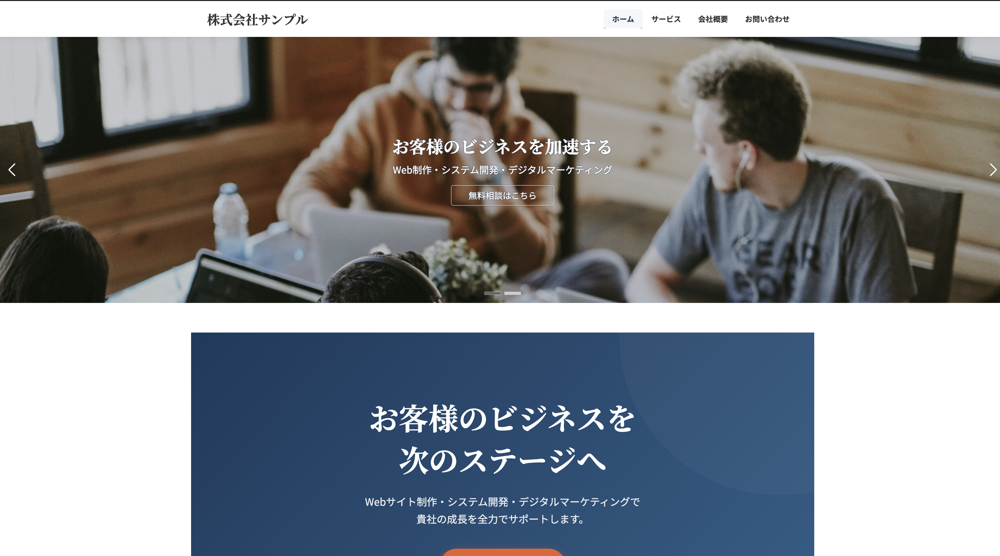
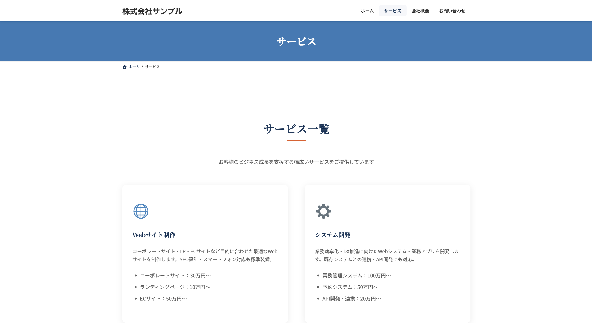
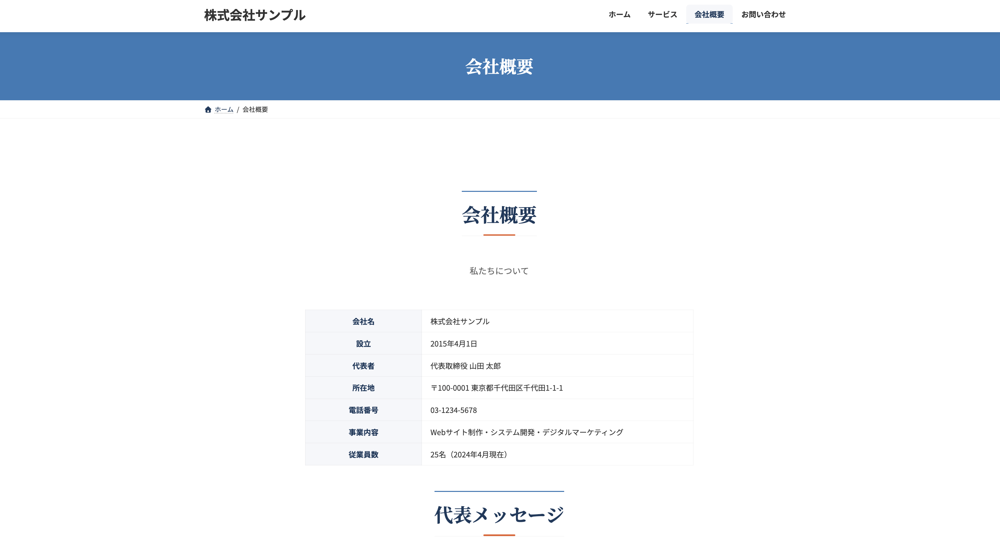
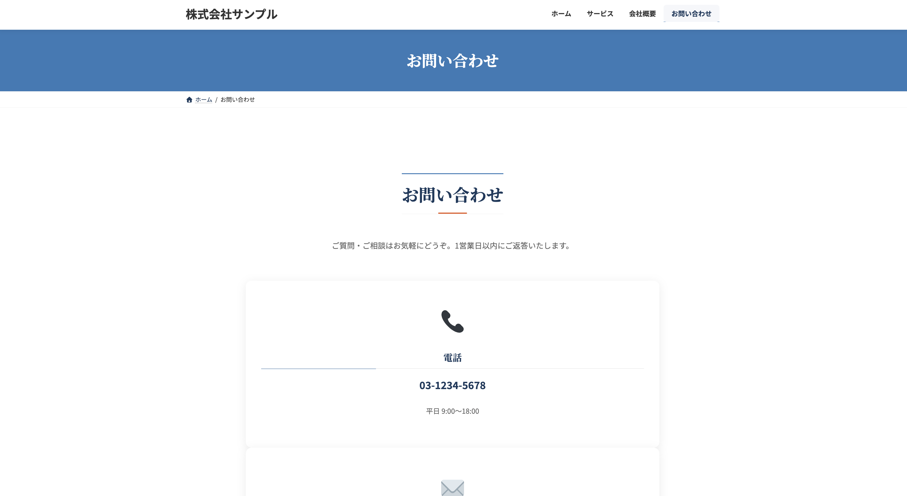

# 🏢 WordPress Corporate Theme

> Lightning子テーマベースのプロ仕様コーポレートサイトテンプレート


## 🌐 デモ

**Live Demo:** https://gray-letter.localsite.io  
Username: `furniture` / Password: `watery`

---

## 📋 概要

医療・介護・製造・小売など**幅広い業種のコーポレートサイト**に転用できる汎用WordPressテンプレートです。クラウドワークスなどのフリーランス案件に即対応できる構成を目指しました。

---

## ✨ 機能・実装内容

| 機能 | 詳細 |
|------|------|
| 🎨 デザイントークン | CSS変数でブランドカラーを一元管理 |
| 📦 カスタム投稿タイプ | 実績・スタッフを独立管理 |
| 🔧 ACFカスタムフィールド | クライアント名・業種・制作年・使用技術 |
| ✨ ScrollRevealアニメーション | スクロール連動の滑らかな表示 |
| 📱 レスポンシブ対応 | スマートフォン・タブレット完全対応 |
| 📧 お問い合わせフォーム | Contact Form 7 + バリデーション |
| 🔍 SEO最適化 | Yoast SEO設定済み |
| ⚡ 画像最適化 | EWWW Image Optimizer + WebP変換 |

---


---

## 📸 スクリーンショット

### トップページ


### サービスページ


### 会社概要ページ


### お問い合わせページ


---
## 🛠 技術スタック

- **CMS:** WordPress 6.9.4
- **テーマ:** Lightning (VektorInc.) + 子テーマ
- **プラグイン:** ACF / Contact Form 7 / Yoast SEO / VK Blocks / EWWW
- **アニメーション:** ScrollReveal.js
- **フォント:** Noto Sans JP / Noto Serif JP (Google Fonts)
- **環境:** LocalWP / PHP 8.2 / MySQL 8.0

---

## 📁 ファイル構成
```
lightning-child/
├── style.css          # テーマ定義 + CSS変数 + 全スタイル
├── functions.php      # カスタム投稿タイプ + ACF + ScrollReveal読み込み
└── js/
    └── main.js        # ScrollReveal + スムーススクロール + ヘッダー制御
```

---

## 🚀 セットアップ

### 必要環境
- WordPress 6.0以上
- PHP 8.0以上
- LocalWP（ローカル開発）

### インストール手順
```bash
# 1. Lightningテーマをインストール・有効化
# WordPress管理画面 → 外観 → テーマ → 新規追加 → "Lightning"を検索

# 2. 子テーマをwp-content/themesに配置
git clone https://github.com/ken-personal/wordpress-corporate-theme.git lightning-child

# 3. 子テーマを有効化
# WordPress管理画面 → 外観 → テーマ → Lightning Child → 有効化

# 4. 必須プラグインをインストール
# Advanced Custom Fields
# Contact Form 7
# Yoast SEO
# VK Blocks
# EWWW Image Optimizer
```

---

## 📄 ページ構成

| ページ | URL | 内容 |
|--------|-----|------|
| ホーム | `/` | ヒーロー・サービス・選ばれる理由・実績・CTA |
| サービス | `/service/` | サービス一覧・料金目安 |
| 会社概要 | `/about/` | 会社情報・代表メッセージ |
| お問い合わせ | `/contact/` | CF7フォーム・電話・所在地 |

---

## 🎨 カスタマイズ

### ブランドカラーの変更

`style.css` の CSS変数を編集するだけで全体のカラーが変わります：
```css
:root {
  --color-primary: #1a3a5c;  /* メインカラー */
  --color-accent:  #e8602c;  /* アクセントカラー */
  --color-text:    #333333;  /* テキストカラー */
}
```

---

## 📊 対応業種

- 🏥 医療・クリニック
- 🏠 介護・福祉
- 🏗 建設・不動産
- 🍽 飲食・食品
- 💻 IT・テクノロジー
- 🛍 小売・EC

---

## 👤 作者

**ken2507**  
- GitHub: [@ken-personal](https://github.com/ken-personal)
- クラウドワークス: WordPress制作・フルスタック開発

---

## 📝 License

MIT License


## 🆕 最新アップデート（2026年3月）

### Tailwind CSS導入
- Tailwind CSS v3をWordPressテーマに統合
- `src/input.css` → `tailwind.css` のビルドパイプライン構築

### カスタムGutenbergブロック
- `register_block_type` + `block.json` によるブロック登録
- PHPテンプレート（`block.php`）でのサーバーサイドレンダリング
- JavaScript（`block.js`）でのエディタUI実装

#### 実装済みブロック
| ブロック名 | 説明 |
|-----------|------|
| ヒーローブロック | グラデーション背景・タイトル・CTA |

#### ブロックファイル構成
```
blocks/
└── hero/
    ├── block.json  # ブロック定義
    ├── block.php   # フロントエンド表示
    └── block.js    # エディタUI
```
